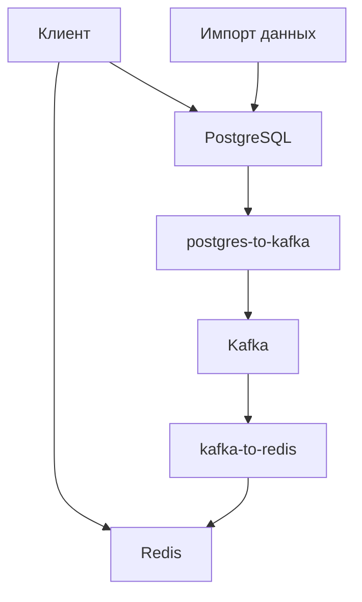
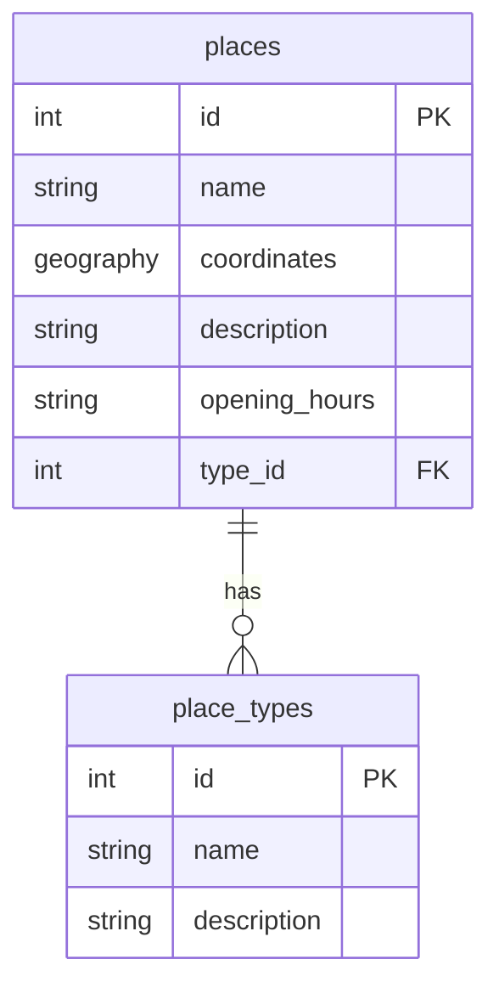
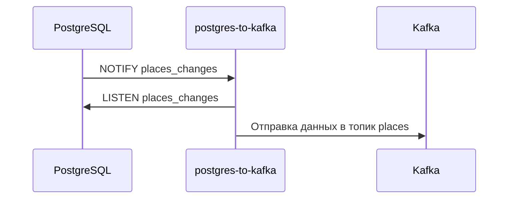
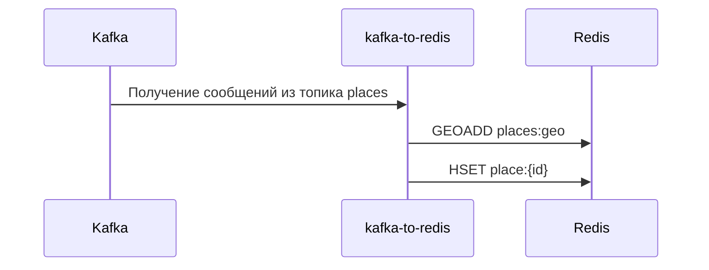
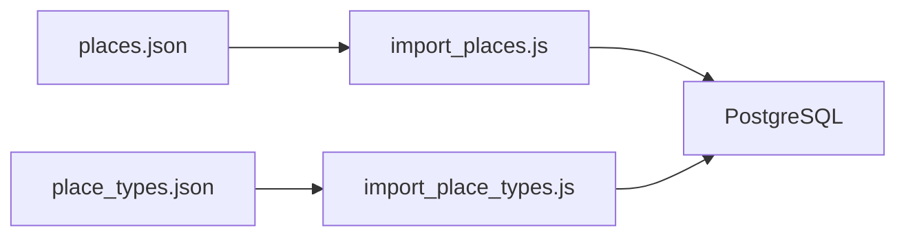
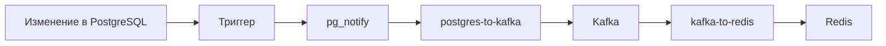
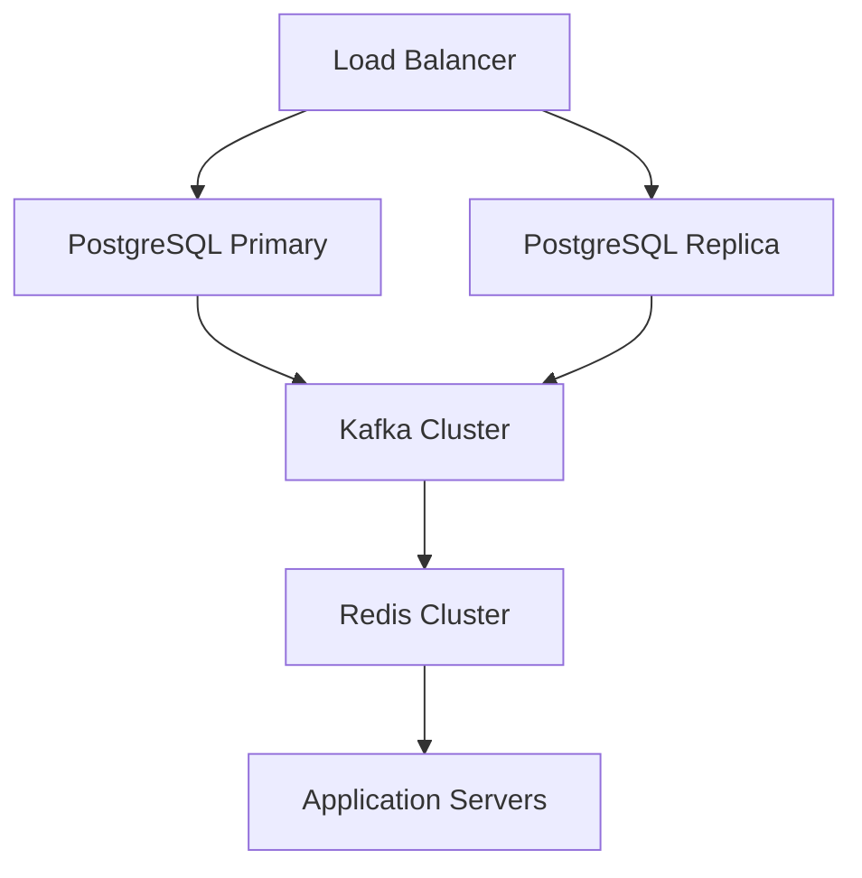
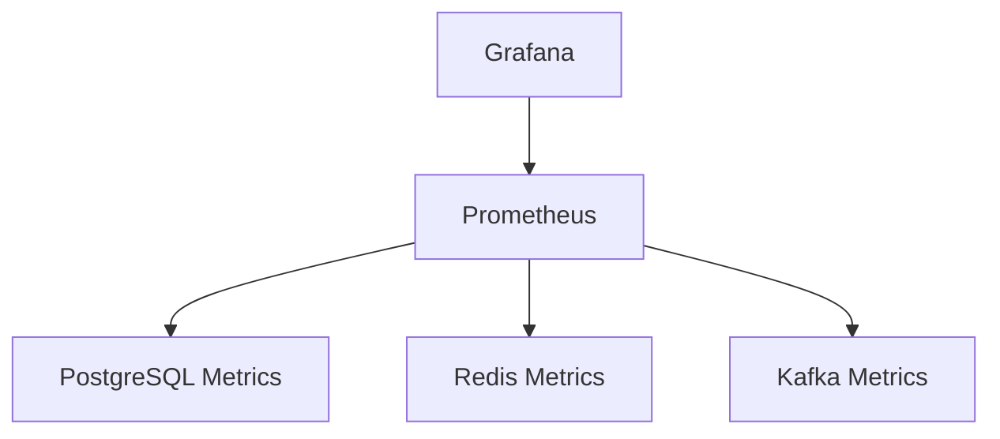
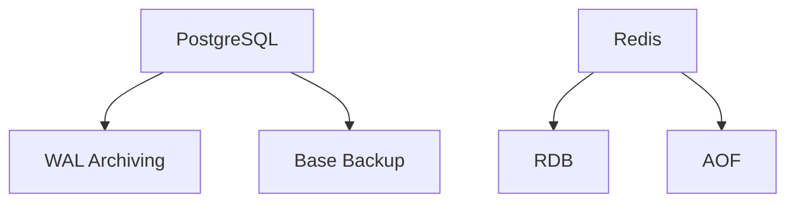

# Архитектура GeoIndexService

## Общее описание

GeoIndexService - это распределенная система для индексации и поиска географических объектов, связанных с ракетно-космической отраслью России. Система построена на микросервисной архитектуре с использованием современных технологий для обработки геопространственных данных.

## Архитектурная диаграмма

## Компоненты системы

### 1. PostgreSQL

**Роль:** Основное хранилище данных с поддержкой геопространственных запросов.

**Особенности:**
- Использование PostGIS для работы с геопространственными данными
- Триггеры для отслеживания изменений
- Поддержка уведомлений через LISTEN/NOTIFY

**Схема данных:**

### 2. Kafka

**Роль:** Брокер сообщений для передачи данных между компонентами.

**Особенности:**
- Топик `places` для передачи данных об объектах
- Надежная доставка сообщений
- Поддержка масштабирования

### 3. Redis

**Роль:** Быстрый кэш с поддержкой геопространственного индекса.

**Структура данных:**
- Геоиндекс `places:geo` для быстрого поиска по радиусу
- Хэши `place:{id}` для хранения информации об объектах

### 4. postgres-to-kafka

**Роль:** Сервис для отслеживания изменений в PostgreSQL и отправки их в Kafka.

**Процесс работы:**

### 5. kafka-to-redis

**Роль:** Сервис для получения данных из Kafka и сохранения их в Redis.

**Процесс работы:**

## Поток данных

### 1. Импорт данных

### 2. Обработка изменений

## Масштабирование

Система поддерживает горизонтальное масштабирование:

## Мониторинг

## Безопасность

1. **PostgreSQL:**
   - Аутентификация через пароль
   - Ограничение доступа по IP
   - Шифрование соединения

2. **Redis:**
   - Аутентификация через пароль
   - Ограничение доступа по IP
   - Шифрование соединения

3. **Kafka:**
   - SSL/TLS для шифрования
   - SASL для аутентификации
   - ACL для контроля доступа

## Резервное копирование

## Ограничения и рекомендации

1. **PostgreSQL:**
   - Рекомендуется использовать SSD для хранения данных
   - Настройка autovacuum для оптимизации производительности
   - Регулярное обновление статистики

2. **Redis:**
   - Мониторинг использования памяти
   - Настройка политики вытеснения
   - Регулярное создание резервных копий

3. **Kafka:**
   - Настройка репликации для надежности
   - Мониторинг отставания потребителей
   - Регулярная очистка старых данных

## Развертывание

### Требования к окружению

- Docker 20.10+
- Docker Compose 2.0+
- 4+ GB RAM
- 2+ CPU cores
- 10+ GB свободного места на диске

### Порты

- PostgreSQL: 5432
- Redis: 6379
- Kafka: 9092
- Redis Commander: 8081
- Kafka UI: 8080

## Устранение неполадок

### Распространенные проблемы

1. **Проблемы с подключением к PostgreSQL:**
   - Проверка доступности порта
   - Проверка учетных данных
   - Проверка прав доступа

2. **Проблемы с Redis:**
   - Проверка использования памяти
   - Проверка подключения
   - Проверка конфигурации

3. **Проблемы с Kafka:**
   - Проверка состояния кластера
   - Проверка отставания потребителей
   - Проверка доступности топиков

### Логи

- PostgreSQL: `/var/log/postgresql/postgresql.log`
- Redis: `/var/log/redis/redis.log`
- Kafka: `/var/log/kafka/server.log`
- postgres-to-kafka: `docker logs geoindexservice-postgres-to-kafka-1`
- kafka-to-redis: `docker logs geoindexservice-kafka-to-redis-1` 