# Архитектура GeoIndexService

## Общее описание

GeoIndexService - это распределенная система для индексации и поиска географических объектов, связанных с ракетно-космической отраслью России. Система построена на микросервисной архитектуре с использованием современных технологий для обработки геопространственных данных.

## Структурная схема компонентов АСОИУ

Диаграмма компонентов системы находится в файле [diagrams/system_components.md](diagrams/system_components.md)

**Основные компоненты:**

1. **Фронтенд**: пользовательский интерфейс, состояние, компоненты React
2. **БФФ**: роутер API, кэширование, авторизация, валидация
3. **Редис**: геоиндекс, кэш данных, управление сессиями
4. **Продюсер**: обработка событий, управление очередью
5. **Кафка**: управление топиками, партиционирование, репликация
6. **Яндекс API**: карты, геокодирование, построение маршрутов

## Архитектурная диаграмма

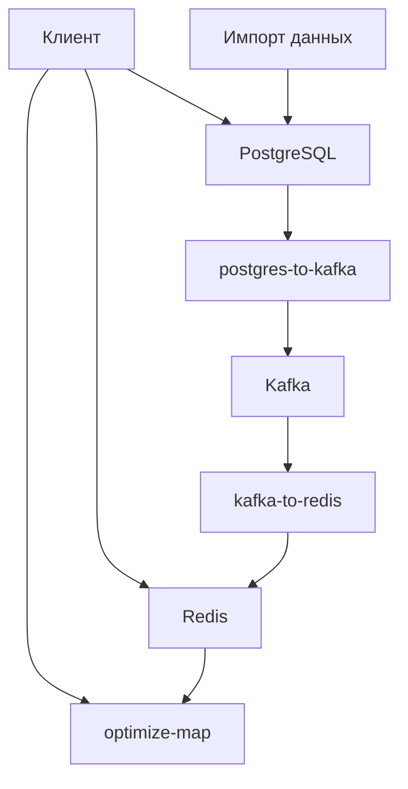

## Компоненты системы

### 1. PostgreSQL

**Роль:** Основное хранилище данных с поддержкой геопространственных запросов.

**Особенности:**
- Использование PostGIS для работы с геопространственными данными
- Триггеры для отслеживания изменений
- Поддержка уведомлений через LISTEN/NOTIFY

**Схема данных:**
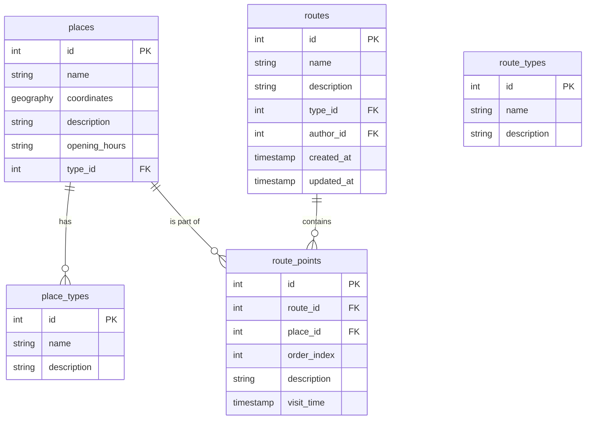

### 2. Kafka

**Роль:** Брокер сообщений для передачи данных между компонентами.

**Особенности:**
- Топик `places` для передачи данных об объектах
- Надежная доставка сообщений
- Поддержка масштабирования

### 3. Redis

**Роль:** Быстрый кэш с поддержкой геопространственного индекса.

**Структура данных:**
- Геоиндекс `places:geo` для быстрого поиска по радиусу
- Хэши `place:{id}` для хранения информации об объектах

### 4. postgres-to-kafka

**Роль:** Сервис для отслеживания изменений в PostgreSQL и отправки их в Kafka.

**Процесс работы:**
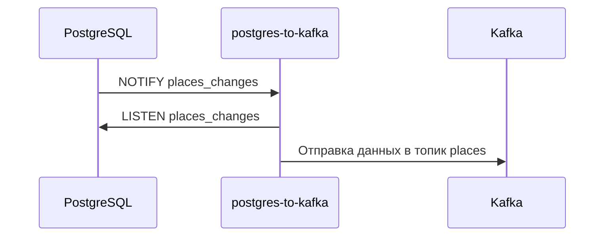

### 5. kafka-to-redis

**Роль:** Сервис для получения данных из Kafka и сохранения их в Redis.

**Процесс работы:**
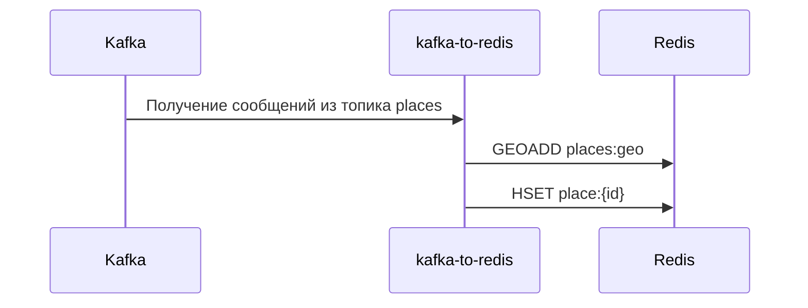

### 6. optimize-map

**Роль:** Сервис для оптимизации данных карты и управления маршрутами.

**Особенности:**
- REST API для работы с геоданными
- Интеграция с Redis для быстрого доступа к данным
- Поддержка кластеризации объектов
- Оптимизация отображения при разных масштабах

**API Endpoints:**
- `GET /spaceObject` - данные космических объектов
- `GET /spaceObjects` - список космических объектов
- `POST /tracks` - информация о треках
- `GET /calculateMapData` - коллекция объектов для карты
- `GET /routes` - список всех маршрутов
- `GET /routes/:id` - информация о конкретном маршруте
- `POST /routes` - создание нового маршрута
- `PUT /routes/:id` - обновление маршрута
- `DELETE /routes/:id` - удаление маршрута
- `GET /route-types` - список типов маршрутов

**Технологии:**
- Express.js для API
- Redis для кэширования
- Turf.js для работы с геоданными
- Winston для логирования

**Архитектура сервиса:**
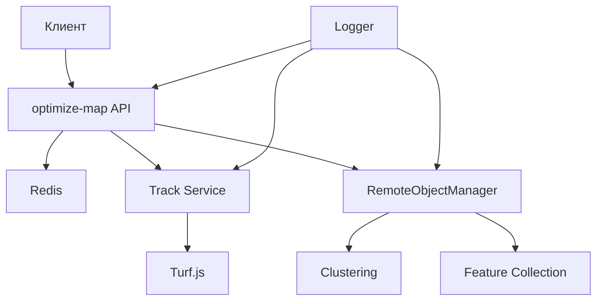

**Процесс обработки запроса:**
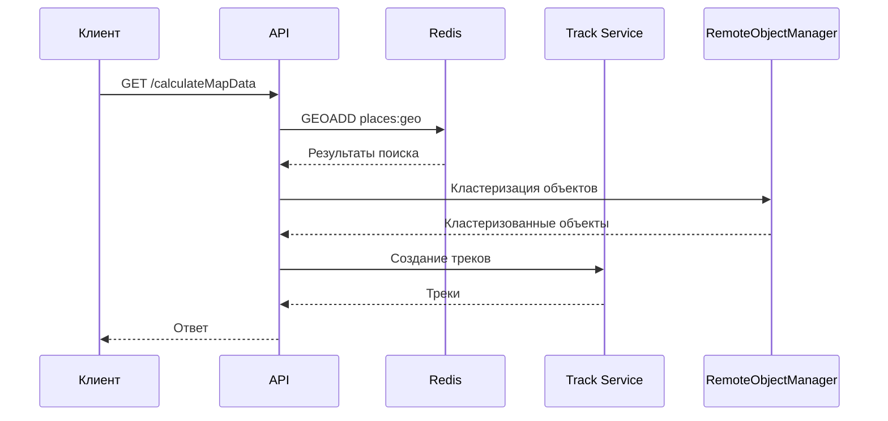

## Поток данных

### 1. Импорт данных

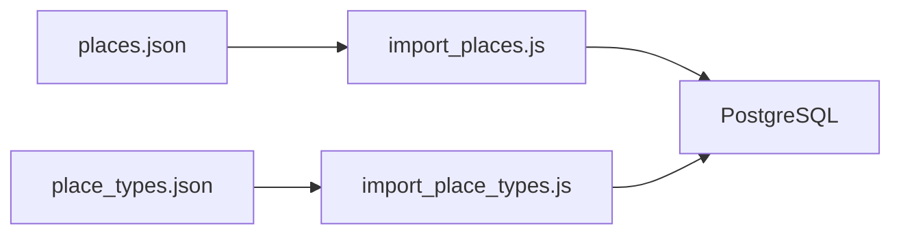

### 2. Обработка изменений

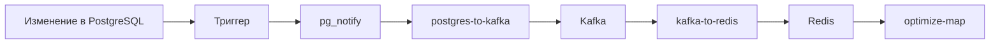

## Масштабирование

Система поддерживает горизонтальное масштабирование:

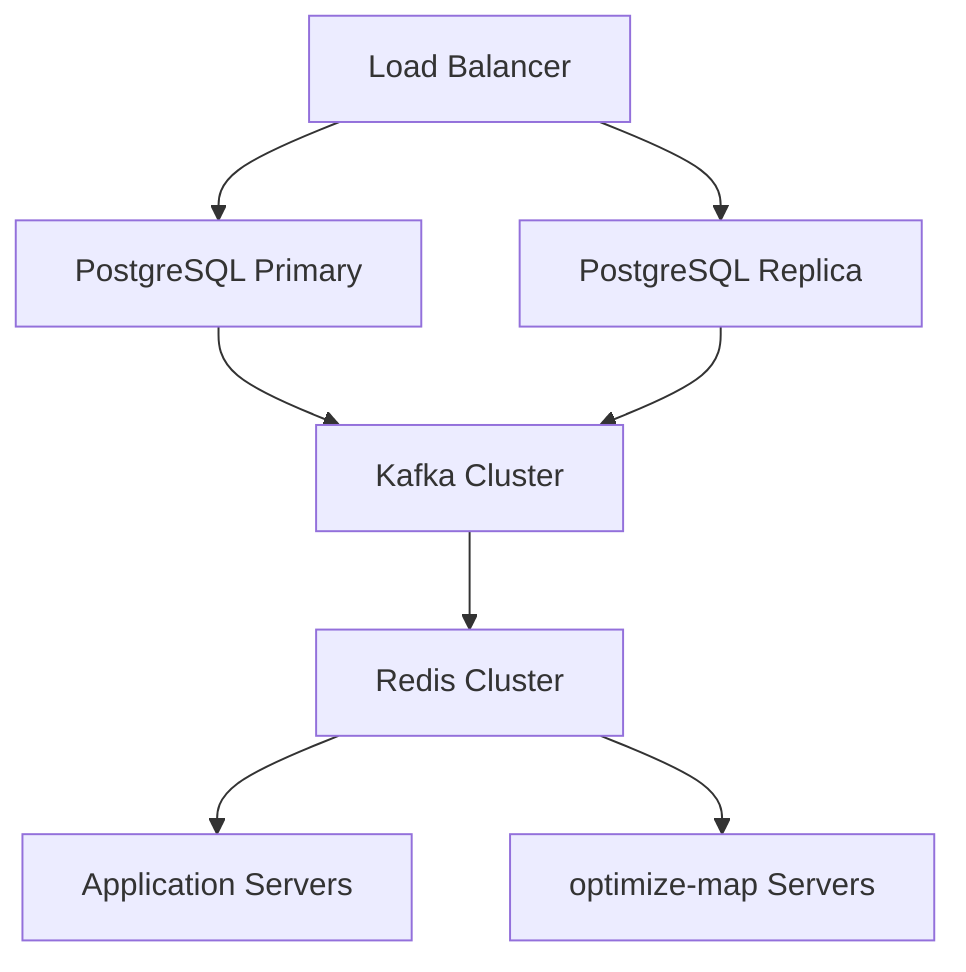

## Мониторинг

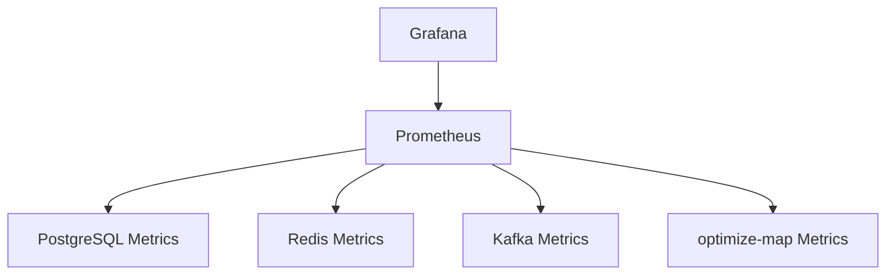

## Безопасность

1. **PostgreSQL:**
   - Аутентификация через пароль
   - Ограничение доступа по IP
   - Шифрование соединения

2. **Redis:**
   - Аутентификация через пароль
   - Ограничение доступа по IP
   - Шифрование соединения

3. **Kafka:**
   - SSL/TLS для шифрования
   - SASL для аутентификации
   - ACL для контроля доступа

4. **optimize-map:**
   - Валидация входных данных
   - Ограничение размера запросов
   - Логирование всех операций

## Резервное копирование

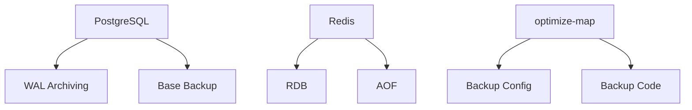

## Ограничения и рекомендации

1. **PostgreSQL:**
   - Рекомендуется использовать SSD для хранения данных
   - Настройка autovacuum для оптимизации производительности
   - Регулярное обновление статистики

2. **Redis:**
   - Мониторинг использования памяти
   - Настройка политики вытеснения
   - Регулярное создание резервных копий

3. **Kafka:**
   - Настройка репликации для надежности
   - Мониторинг отставания потребителей
   - Регулярная очистка старых данных

4. **optimize-map:**
   - Мониторинг времени ответа
   - Оптимизация запросов к Redis
   - Регулярное обновление зависимостей

## Развертывание

### Требования к окружению

- Docker 20.10+
- Docker Compose 2.0+
- 4+ GB RAM
- 2+ CPU cores
- 10+ GB свободного места на диске

### Порты

- PostgreSQL: 5432
- Redis: 6379
- optimize-map: 8000

### Docker Compose

```yaml
version: '3.8'

services:
  postgres:
    image: postgis/postgis:15-3.3
    environment:
      POSTGRES_USER: postgres
      POSTGRES_PASSWORD: postgres
      POSTGRES_DB: geoindex
    ports:
      - "5432:5432"
    volumes:
      - postgres_data:/var/lib/postgresql/data
    healthcheck:
      test: ["CMD-SHELL", "pg_isready -U postgres"]
      interval: 5s
      timeout: 5s
      retries: 5

  redis:
    image: redis:7.0
    ports:
      - "6379:6379"
    volumes:
      - redis_data:/data
    healthcheck:
      test: ["CMD", "redis-cli", "ping"]
      interval: 5s
      timeout: 5s
      retries: 5

  optimize-map:
    build: ./optimizeMap
    ports:
      - "8000:8000"
    environment:
      - POSTGRES_USER=postgres
      - POSTGRES_PASSWORD=postgres
      - POSTGRES_DB=geoindex
      - POSTGRES_HOST=postgres
      - POSTGRES_PORT=5432
      - REDIS_HOST=redis
      - REDIS_PORT=6379
    depends_on:
      postgres:
        condition: service_healthy
      redis:
        condition: service_healthy

volumes:
  postgres_data:
  redis_data:
```

### Запуск

1. Клонируйте репозиторий
2. Перейдите в директорию проекта
3. Запустите сервисы:
```bash
docker-compose up -d
```

4. Примените миграции базы данных:
```bash
docker-compose exec postgres psql -U postgres -d geoindex -f /app/migrations/002_create_routes_tables.sql
docker-compose exec postgres psql -U postgres -d geoindex -f /app/migrations/003_migrate_existing_routes.sql
```

### Проверка работоспособности

1. Проверьте статус сервисов:
```bash
docker-compose ps
```

2. Проверьте логи:
```bash
docker-compose logs -f optimize-map
```

3. Проверьте API:
```bash
curl http://localhost:8000/routes
curl http://localhost:8000/route-types
```

## Устранение неполадок

### Распространенные проблемы

1. **Проблемы с подключением к PostgreSQL:**
   - Проверка доступности порта
   - Проверка учетных данных
   - Проверка прав доступа

2. **Проблемы с Redis:**
   - Проверка использования памяти
   - Проверка подключения
   - Проверка конфигурации

3. **Проблемы с Kafka:**
   - Проверка состояния кластера
   - Проверка отставания потребителей
   - Проверка доступности топиков

4. **Проблемы с optimize-map:**
   - Проверка подключения к Redis
   - Проверка логов на ошибки
   - Проверка доступности API

### Логи

- PostgreSQL: `/var/log/postgresql/postgresql.log`
- Redis: `/var/log/redis/redis.log`
- Kafka: `/var/log/kafka/server.log`
- postgres-to-kafka: `docker logs geoindexservice-postgres-to-kafka-1`
- kafka-to-redis: `docker logs geoindexservice-kafka-to-redis-1`
- optimize-map: `docker logs geoindexservice-optimize-map-1`

## Схема базы данных

### Таблицы

#### 1. place_types
Таблица для хранения типов мест.

```sql
CREATE TABLE place_types (
    id SERIAL PRIMARY KEY,
    name VARCHAR(255) NOT NULL,
    description TEXT
);
```

**Назначение:** Хранит категории мест (достопримечательности, парки, музеи и т.д.).

#### 2. places
Таблица для хранения информации о местах с поддержкой геопространственных данных.

```sql
CREATE TABLE places (
    id SERIAL PRIMARY KEY,
    name VARCHAR(255) NOT NULL,
    coordinates geography(POINT) NOT NULL,
    type_id INTEGER REFERENCES place_types(id),
    description TEXT,
    opening_hours VARCHAR(255),
    created_at TIMESTAMP WITH TIME ZONE DEFAULT CURRENT_TIMESTAMP
);
```

**Назначение:** Основная таблица для хранения информации о местах с их географическими координатами.

#### 3. route_types
Таблица для хранения типов маршрутов.

```sql
CREATE TABLE route_types (
    id SERIAL PRIMARY KEY,
    name VARCHAR(100) NOT NULL,
    description TEXT,
    created_at TIMESTAMP WITH TIME ZONE DEFAULT CURRENT_TIMESTAMP,
    updated_at TIMESTAMP WITH TIME ZONE DEFAULT CURRENT_TIMESTAMP
);
```

**Назначение:** Хранит категории маршрутов (образовательные, технические, исторические и т.д.).

#### 4. routes
Таблица для хранения маршрутов.

```sql
CREATE TABLE routes (
    id SERIAL PRIMARY KEY,
    name VARCHAR(255) NOT NULL,
    description TEXT,
    type_id INTEGER REFERENCES route_types(id),
    author_id INTEGER,
    created_at TIMESTAMP WITH TIME ZONE DEFAULT CURRENT_TIMESTAMP,
    updated_at TIMESTAMP WITH TIME ZONE DEFAULT CURRENT_TIMESTAMP
);
```

**Назначение:** Хранит информацию о маршрутах, их типах и авторах.

#### 5. route_points
Таблица для хранения точек маршрутов.

```sql
CREATE TABLE route_points (
    id SERIAL PRIMARY KEY,
    route_id INTEGER REFERENCES routes(id) ON DELETE CASCADE,
    place_id INTEGER REFERENCES places(id) ON DELETE CASCADE,
    order_index INTEGER NOT NULL,
    description TEXT,
    visit_time TIMESTAMP WITH TIME ZONE,
    created_at TIMESTAMP WITH TIME ZONE DEFAULT CURRENT_TIMESTAMP,
    updated_at TIMESTAMP WITH TIME ZONE DEFAULT CURRENT_TIMESTAMP,
    CONSTRAINT unique_route_point_order UNIQUE (route_id, order_index)
);
```

**Назначение:** Хранит точки маршрутов с их порядком и временем посещения.

### Индексы

#### 1. Геопространственные индексы
```sql
CREATE INDEX places_coordinates_idx ON places USING GIST (coordinates);
```
**Назначение:** Оптимизирует геопространственные запросы (поиск по радиусу, поиск ближайших объектов).

#### 2. Индексы для маршрутов
```sql
CREATE INDEX idx_route_points_route_id ON route_points(route_id);
CREATE INDEX idx_route_points_place_id ON route_points(place_id);
CREATE INDEX idx_routes_type_id ON routes(type_id);
```
**Назначение:** Оптимизируют запросы по поиску точек маршрута и фильтрации маршрутов по типу.

### Функции и триггеры

#### 1. Функция обновления updated_at
```sql
CREATE OR REPLACE FUNCTION update_updated_at_column()
RETURNS TRIGGER AS $$
BEGIN
    NEW.updated_at = CURRENT_TIMESTAMP;
    RETURN NEW;
END;
$$ language 'plpgsql';
```
**Назначение:** Автоматически обновляет поле updated_at при изменении записи.

#### 2. Функция уведомлений об изменениях
```sql
CREATE OR REPLACE FUNCTION notify_places_changes()
RETURNS TRIGGER AS $$
BEGIN
    PERFORM pg_notify(
        'places_changes',
        json_build_object(
            'operation', TG_OP,
            'id', COALESCE(NEW.id, OLD.id),
            'name', COALESCE(NEW.name, OLD.name),
            'coordinates', COALESCE(NEW.coordinates::text, OLD.coordinates::text),
            'type_id', COALESCE(NEW.type_id, OLD.type_id),
            'description', COALESCE(NEW.description, OLD.description),
            'opening_hours', COALESCE(NEW.opening_hours, OLD.opening_hours)
        )::text
    );
    RETURN NEW;
END;
$$ LANGUAGE plpgsql;
```
**Назначение:** Отправляет уведомления об изменениях в таблице places через механизм LISTEN/NOTIFY.

### Триггеры

#### 1. Триггеры обновления updated_at
```sql
CREATE TRIGGER update_routes_updated_at
    BEFORE UPDATE ON routes
    FOR EACH ROW
    EXECUTE FUNCTION update_updated_at_column();

CREATE TRIGGER update_route_points_updated_at
    BEFORE UPDATE ON route_points
    FOR EACH ROW
    EXECUTE FUNCTION update_updated_at_column();

CREATE TRIGGER update_route_types_updated_at
    BEFORE UPDATE ON route_types
    FOR EACH ROW
    EXECUTE FUNCTION update_updated_at_column();
```
**Назначение:** Автоматически обновляют поле updated_at при изменении записей в соответствующих таблицах.

#### 2. Триггер уведомлений об изменениях
```sql
CREATE TRIGGER places_changes_trigger
    AFTER INSERT OR UPDATE OR DELETE
    ON places
    FOR EACH ROW
    EXECUTE FUNCTION notify_places_changes();
```
**Назначение:** Отслеживает изменения в таблице places и отправляет уведомления.

### Ограничения

1. **Уникальный порядок точек в маршруте:**
```sql
CONSTRAINT unique_route_point_order UNIQUE (route_id, order_index)
```
**Назначение:** Гарантирует уникальность порядкового номера точки в рамках одного маршрута.

2. **Внешние ключи:**
- `places.type_id` -> `place_types.id` - связь места с его типом
- `routes.type_id` -> `route_types.id` - связь маршрута с его типом (образовательный, технический и т.д.)
- `route_points.route_id` -> `routes.id` - связь точки маршрута с маршрутом
- `route_points.place_id` -> `places.id` - связь точки маршрута с местом

**Назначение:** Обеспечивают целостность данных и каскадное удаление. Например:
- При удалении типа маршрута нельзя удалить маршруты этого типа
- При удалении маршрута автоматически удаляются все его точки
- При удалении места автоматически удаляются все точки маршрутов, ссылающиеся на это место

### Процесс работы с данными

1. **Создание маршрута:**
   - Создается запись в таблице `routes`
   - Добавляются точки маршрута в таблицу `route_points`
   - Каждая точка связывается с существующим местом из таблицы `places`

2. **Изменение места:**
   - Обновляется запись в таблице `places`
   - Срабатывает триггер `places_changes_trigger`
   - Отправляется уведомление через `pg_notify`
   - Сервис `postgres-to-kafka` получает уведомление и отправляет данные в Kafka
   - Сервис `kafka-to-redis` обновляет данные в Redis

3. **Поиск мест:**
   - Геопространственные запросы используют индекс `places_coordinates_idx`
   - Поиск по типу использует связь с таблицей `place_types`
   - Поиск по маршруту использует индексы `idx_route_points_route_id` и `idx_route_points_place_id` 