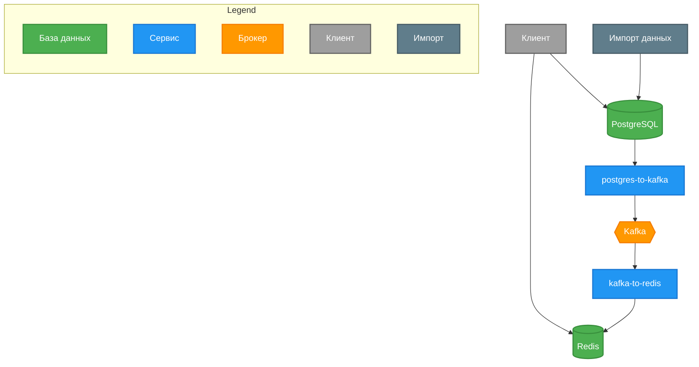
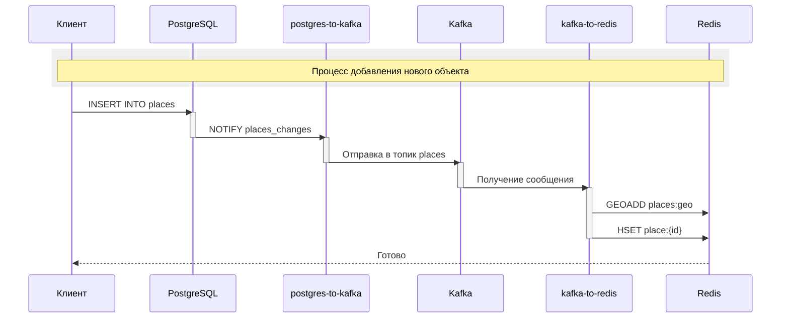
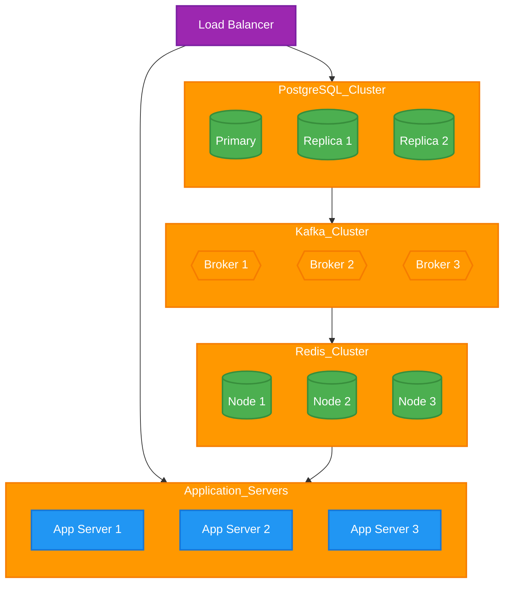
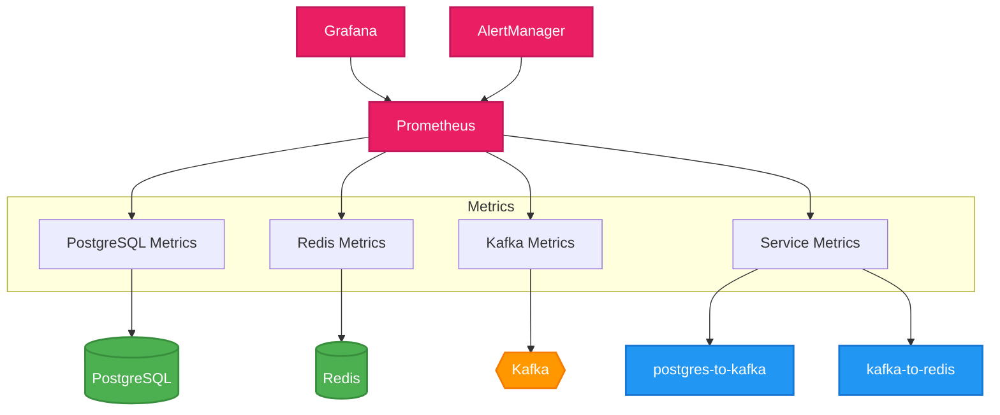
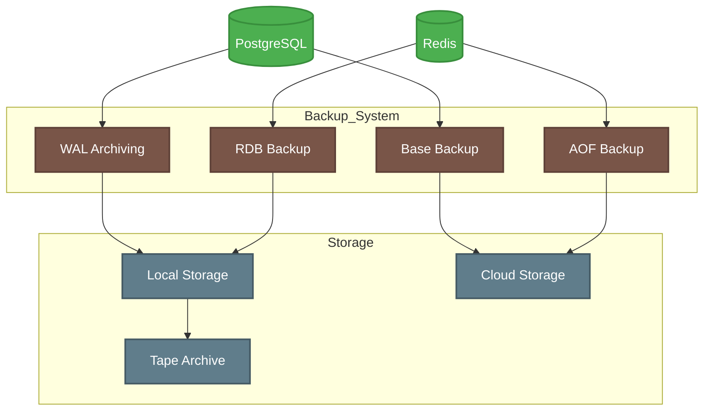
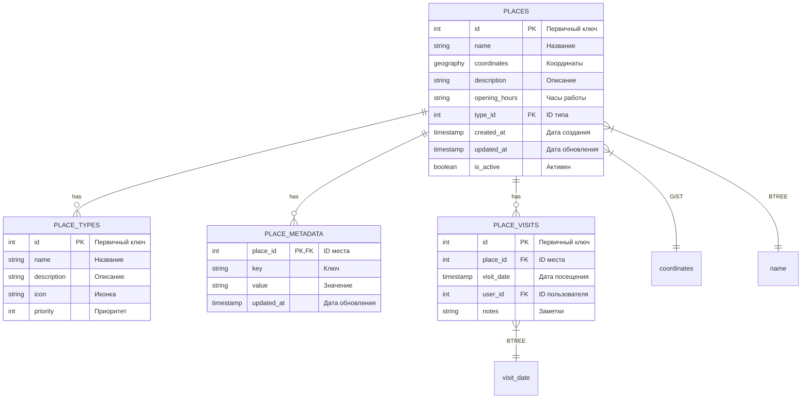

# Визуализация архитектуры GeoIndexService

## 1. Основная архитектура системы



## 2. Процесс обработки данных



## 3. Схема данных

```mermaid
erDiagram
    %% Стили
    classDef table fill:#4CAF50,stroke:#388E3C,color:white,stroke-width:2px
    classDef field fill:#E8F5E9,stroke:#C8E6C9,color:black,stroke-width:1px
    classDef pk fill:#FFC107,stroke:#FFA000,color:black,stroke-width:1px
    classDef fk fill:#FFE0B2,stroke:#FFB74D,color:black,stroke-width:1px

    %% Таблицы
    places {
        int id PK "Первичный ключ"
        string name "Название"
        geography coordinates "Координаты"
        string description "Описание"
        string opening_hours "Часы работы"
        int type_id FK "ID типа"
    }:::table

    place_types {
        int id PK "Первичный ключ"
        string name "Название"
        string description "Описание"
    }:::table

    %% Связи
    places ||--o{ place_types : "has"
```

## 4. Масштабирование системы



## 5. Система мониторинга



## 6. Система резервного копирования



## 7. Расширенная схема данных

