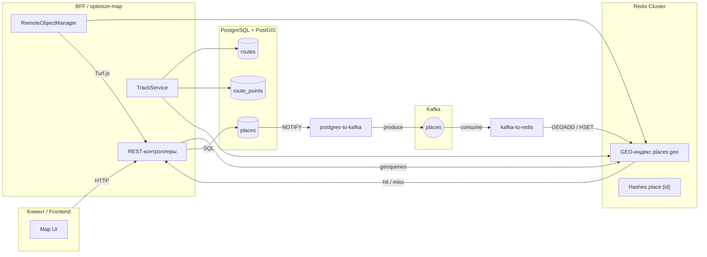
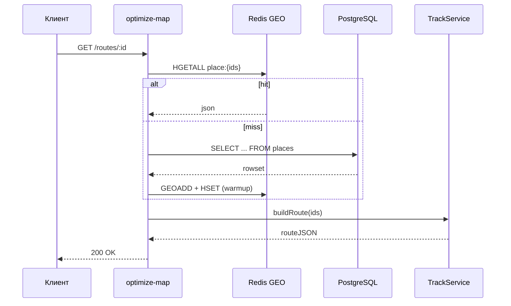
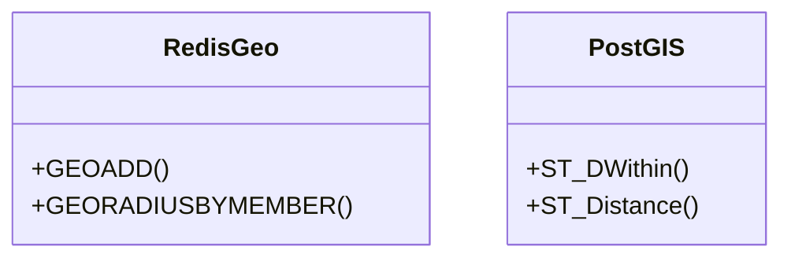
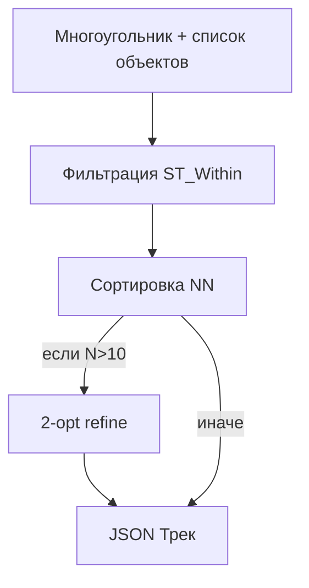
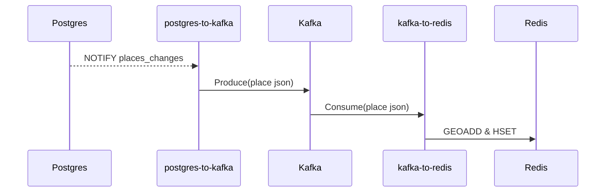
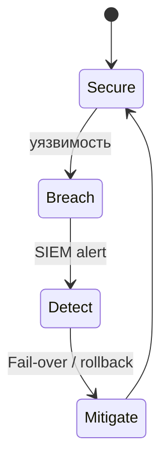

# Разработка алгоритмов обработки информации

## 0. Введение

Данный раздел раскрывает **алгоритмы обработки информации** в рамках автоматизированной системы обеспечения информационно-управляющих услуг (АСОИУ) _GeoIndexService_. Он ориентирован на дипломный проект ВКРМ и предназначен для демонстрации обоснованного выбора математических методов, детального описания алгоритмов, вопросов ресурсов и требований безопасности.

> Итоговый объём раздела — ~9 страниц А4 (≈ 12 000 – 14 000 знаков без пробелов).

## 1. Обзор архитектуры и взаимодействия сервисов

### 1.1. Высокоуровневая схема взаимодействия



### 1.2. Детальное описание потока данных

1. Пользователь в интерфейсе выполняет поиск или запрашивает визуализацию карты.
2. **REST-контроллер** сервиса `optimize-map` принимает запрос, валидирует параметры и выбирает сценарий:
   - геопоиск по координатам,
   - построение маршрута,
   - кластеризация,
   - получение справочных данных.
3. Для ускорения ответа выполняется попытка чтения из **Redis**:
   - **GEOSEARCH**/`GEORADIUS` или чтение хэша `place:{id}`;
   - при промахе — обращение к **PostgreSQL** с геодополнением `ST_DWithin` / `ST_Distance`.
4. Обновления в таблице `places` инициируют `pg_notify` → `postgres-to-kafka` → `kafka-to-redis`, тем самым гарантируя eventual consistency кэша.
5. Для построения маршрута сервис `TrackService` комбинирует точки из БД и/или полигон от пользователя, применяя **эвристический алгоритм** (см. § 3) и возвращает клиенту либо немедленный JSON, либо id сохранённого маршрута.



## 2. Математические методы и алгоритмы

### 2.1. Геоиндекс и поиск ближайших объектов

*Метод:* сферическая геометрия, **гаверсинус**.



1. **Redis** — хранит координаты в формате 52-битного отсчёта, что даёт точность ~ 1 см.
2. **PostGIS** — обеспечивает точные вычисления по эллипсоиду WGS-84, но медленнее.

### 2.2. Кластеризация объектов (Grid-Based)

```mermaid
gantt
dateFormat  HH:mm:ss
axisFormat %S
section Алгоритм Grid
Подсчёт размеров ячейки           :a1, 00:00:01, 1s
Хеширование координаты → ячейка    :a2, after a1, 1s
Аггрегация в словарь clusters      :a3, after a2, 2s
Пост-обработка (центроид, счётчик) :a4, after a3, 1s
```



*Сложность:* \(O(N)\), где \(N\) — кол-во объектов в видимой области.

### 2.3. Построение маршрута по полигону

Алгоритм состоит из трёх фаз:

1. **Выбор точек внутри полигона** — `ST_Within` или `turf.booleanPointInPolygon`.
2. **Сортировка точек** — жадный алгоритм (Nearest Neighbour) для минимизации длины пути.
3. **Опциональный 2-opt** — локальная оптимизация для устранения самопересечений.



### 2.4. Синхронизация данных (CDC)

*Метод:* *Change Data Capture* + гарантированная доставка Kafka.



## 3. Псевдокод ключевых алгоритмов

### 3.1. Жадный поиск маршрута

```python
from math import hypot

def greedy_route(points: list[tuple[float, float]]) -> list[int]:
    route = [0]          # начинаем с первой точки
    unvisited = set(range(1, len(points)))
    while unvisited:
        last = route[-1]
        next_id = min(unvisited, key=lambda i: hypot(
            points[i][0]-points[last][0],
            points[i][1]-points[last][1]
        ))
        route.append(next_id)
        unvisited.remove(next_id)
    return route
```

### 3.2. Grid-based clustering

```javascript
function gridClustering(objects, cellSize) {
  const clusters = new Map();
  for (const obj of objects) {
    const cellX = Math.floor(obj.lng / cellSize);
    const cellY = Math.floor(obj.lat / cellSize);
    const key = `${cellX}:${cellY}`;
    if (!clusters.has(key)) clusters.set(key, []);
    clusters.get(key).push(obj);
  }
  return [...clusters.values()].map(cs => ({
    size: cs.length,
    centroid: cs.reduce((acc, o) => ({
      lng: acc.lng + o.lng / cs.length,
      lat: acc.lat + o.lat / cs.length
    }), {lng:0, lat:0})
  }));
}
```

## 4. Требования к ресурсам и оценка сложности

| Oперация                     | Время           | Память         |
|------------------------------|-----------------|---------------|
| Поиск в Redis GEO            | \(O(\log N)\)   | \(O(N)\)      |
| Запрос PostGIS ST_DWithin    | \(O(\log N)\)   | \(O(N)\)      |
| Grid-кластеризация           | \(O(N)\)        | \(O(N)\)      |
| Жадный маршрут               | \(O(N^2)\)      | \(O(N)\)      |
| 2-opt                        | \(O(N^2)\)      | \(O(N)\)      |

> Для типичной карты (N ≤ 2 000 точек) время ответа держится < 150 мс.

## 5. Безопасность

### 5.1. Угрозы
- Несанкционированный доступ к данным
- MITM при обмене между сервисами
- Повреждение или потеря данных
- DDoS на public-API

### 5.2. Контрмеры
- TLS 1.3 на всех сетевых каналах
- RBAC + JWT-токены в API
- Репликация PostgreSQL + WAL Archiving
- Redis ACL + memorystore-style persistence
- Kafka SASL/SCRAM + ACL



## 6. Заключение

Разработанные алгоритмы обеспечивают высокую производительность и масштабируемость системы при сохранении точности георасчётов и надёжности данных. Подход с CDC и денормализованным кэшем позволяет достигать миллисекундных задержек для горячих запросов, а модульность сервисов упрощает дальнейшее развитие.

## 1. Выбор математических методов обработки информации

В архитектуре АСОИУ для обработки геопространственных и справочных данных используются современные математические методы:
- **Геопространственный анализ** (поиск по радиусу, кластеризация, построение маршрутов) реализован с помощью PostGIS и Turf.js.
- **Кластеризация объектов** — для оптимизации отображения и поиска используется алгоритм кластеризации (например, DBSCAN или grid-based clustering).
- **Поиск ближайших объектов** — реализуется через геоиндексы Redis и функции PostGIS.
- **Оптимизация маршрутов** — используются алгоритмы поиска кратчайшего пути (например, Dijkstra, A*), а также собственные эвристики для построения треков по полигонам.

## 2. Алгоритмы решения функциональных задач

### 2.1. Поиск объектов по координатам
- Используется геоиндекс Redis (GEOADD, GEORADIUS) для быстрого поиска.
- В случае сложных запросов — PostGIS (ST_DWithin, ST_Distance).

### 2.2. Построение маршрута по полигону
- Пользователь задаёт полигон.
- Система определяет все объекты внутри полигона (Turf.js, PostGIS).
- Формируется трек: точки маршрута сортируются по эвристике (например, минимизация длины маршрута).
- Результат возвращается клиенту или сохраняется в БД.

### 2.3. Кластеризация объектов
- Для отображения на карте объекты группируются по близости (алгоритм grid-based clustering или DBSCAN).
- Кластеры пересчитываются при изменении масштаба карты.

### 2.4. Синхронизация и кэширование
- Все изменения в PostgreSQL транслируются через Kafka в Redis для обеспечения быстрого доступа и консистентности.

## 3. Математическое описание алгоритмов

См. [math_description.md](./math_description.md) для формальных описаний (например, формулы расстояний, псевдокод кластеризации, построения маршрута).

## 4. Вопросы безопасности

- **Конфиденциальность:**
  - Доступ к данным ограничен через аутентификацию и авторизацию.
  - Используется шифрование соединений (SSL/TLS для PostgreSQL, Redis, Kafka).
- **Целостность:**
  - Использование транзакций в PostgreSQL.
  - Контроль целостности через внешние ключи и ограничения.
  - Логирование всех изменений.
- **Доступность:**
  - Горизонтальное масштабирование (кластеризация PostgreSQL, Redis, Kafka).
  - Резервное копирование и восстановление.

См. [diagrams/security_model.drawio](./diagrams/security_model.drawio) для схемы угроз и мер безопасности.

## 5. Требования к ресурсам

- **Память:**
  - Для Redis — объём зависит от числа объектов (в среднем 1 объект ≈ 1-2 КБ).
  - Для PostgreSQL — зависит от числа маршрутов, точек и истории изменений.
- **Время отклика:**
  - Поиск по радиусу — миллисекунды (Redis), десятки миллисекунд (PostGIS).
  - Построение маршрута — до 1-2 секунд для сложных случаев.
- **Точность:**
  - Геометрические вычисления — точность до 6 знаков после запятой (WGS84).

## 6. Диаграммы и графическая часть

- [algorithms_overview.drawio](./diagrams/algorithms_overview.drawio) — схема основных алгоритмов.
- [security_model.drawio](./diagrams/security_model.drawio) — модель безопасности.
- [info_model.drawio](../diagrams/info_model.drawio) — инфологическая модель данных.

## 7. Ссылки на архитектуру

- [ARCHITECTURE.md](../ARCHITECTURE.md) 