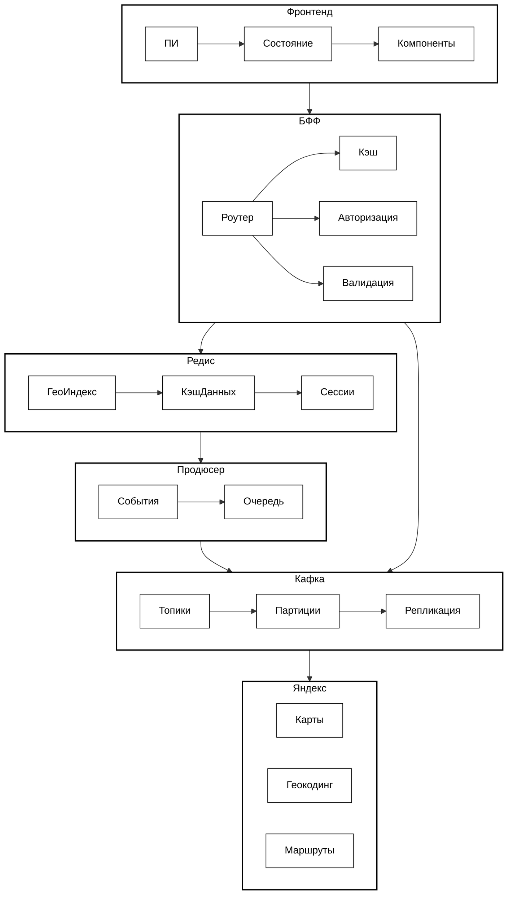

```mermaid
graph TD
    subgraph Фронтенд["Фронтенд"]
        ПИ[ПИ] --> Сост[Состояние]
        Сост --> Комп[Компоненты]
    end

    subgraph БФФ["БФФ"]
        Роут[Роутер] --> Кэш & Авт[Авторизация] & Вал[Валидация]
    end

    subgraph Редис["Редис"]
        ГеоИнд[ГеоИндекс] --> КэшД[КэшДанных]
        КэшД --> Сессии
    end

    subgraph Прод["Продюсер"]
        Соб[События] --> Очер[Очередь]
    end

    subgraph Кафка["Кафка"]
        Топики --> Парт[Партиции] --> Репл[Репликация]
    end

    subgraph Яндекс["Яндекс"]
        Карты & Гео[Геокодинг] & Марш[Маршруты]
    end

    Фронтенд --> БФФ
    БФФ --> Редис
    Редис --> Прод
    Прод --> Кафка
    БФФ --> Кафка
    Кафка --> Яндекс

    %% Стили
    classDef default fill:#fff,stroke:#000,stroke-width:1px,color:#000
    classDef container fill:#fff,stroke:#000,stroke-width:2px,color:#000
    
    class Фронтенд,БФФ,Редис,Прод,Кафка,Яндекс container
``` 